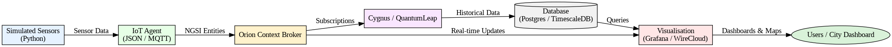

# Simulação de Cidade Inteligente com FIWARE

Este projeto é um Trabalho de Conclusão de Curso com ênfase no **Ecosistema FIWARE**, com o objetivo de simular uma cidade inteligente.
Seu foco é em **sensores ambientais** (qualidade do ar) e **dados de tráfego** (veículos e semáforos).
O objetivo é um estudo prático e aprofundado das caracteristicas e capacidades do FIWARE.

---

## 🚦 Panorama

* **Dompinio**: Ambiente Inteliogente + Mobilidade Inteligente
* **Componentes FIWARE Principais**:

  * Orion Context Broker
  * IoT Agent (JSON or MQTT)
  * Cygnus (persitente) or QuantumLeap (armazenamento time-series)
  * PostgreSQL / TimescaleDB
  * Grafana ou WireCloud para dashboards

---

## 🏗 Arquitetura



**Fluxo de Dados**:

1. Sendores simulados (Python) geram dados de tráfego e qualidade do ar.
2. IoT Agent converte mensagens de sensor em entidades NGSI.
3. Orion Context Brokerarmazena e gerencia dados de contexto atual.
4. Cygnus/QuantumLeap armazenam os dados em PostgreSQL/TimescaleDB.
5. Grafana/WireCloud visualizam os dados para dashboards da cidade.

---

## 📦 Estrutura do Projeto

```
Cidade Inteligente/
├── README.md
├── diario.md
├── docs/
│   ├── arquitetura.png
    └── Caso de Uso.md
├── docker/
│   └── docker-compose.yml
├── simuladores/
│   ├── sim_ar.py
    ├── sim_trafego.py
    └── config.yml
└── configs/
    ├── dispositivos_iot.json
    └── entidades_orion_exemplos.json
```

---

## 🚀 Como Rodar

### Requisitos

* Docker + Docker Compose
* Python 3.10+

### Setup

```bash
git clone <this-repo>
cd fiware-smartcity-sim/docker
docker-compose up -d
```

### Simulators

Run the Python sensor simulator:

```bash
cd simulators
python sensors.py
```

---

## 📊 Visualização

* Grafana dashboards em `http://localhost:3000`
* WireCloud em `http://localhost:8000`

---

## ✍️ Notas

Ver [diario.md](diario.md) notas de estudo e diário de desenvolvimento.
